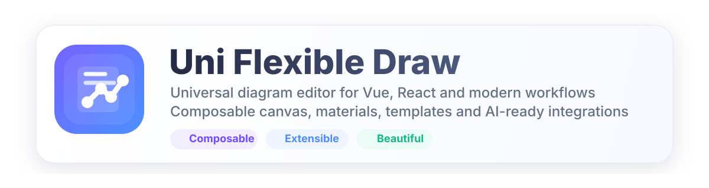
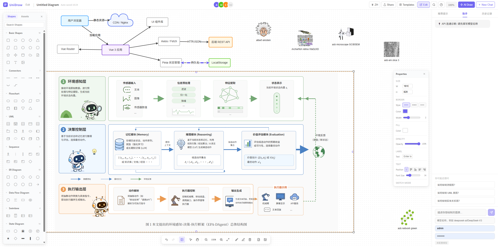

<p align="center">
  
</p>

<p align="center">
  
  
  
  
  
</p>

<p align="center">
  
</p>

<p align="center">
  <strong>English</strong> | <a href="./README.zh-CN.md">简体中文</a>
</p>

# Uni Flexible Draw

A universal diagramming component library built with `Vue 3 + AntV X6`, featuring:

- The all-in-one editor `UniDraw`
- Composable canvas and panel subcomponents
- Vue integration
- React wrapper integration
- Shape libraries, asset panel, template panel, quick action bar, and related capabilities
- A standalone Node.js server for asset APIs and AI proxy endpoints

## Project Positioning

This repository currently provides two usage paths:

- **Vue component path**
  - Main entry: `@uni-draw/draw`
  - Best when you want to use the full editor or individual subcomponents directly in a Vue app

- **React path**
  - Entry: `@uni-draw/draw/react`
  - Internally this is a React wrapper around `lib/UniDraw.ts`
  - Best when you want to use the editor in a React project via a component plus ref API

## Component Overview

### 1. `UniDraw`

The main editor component, which already includes:

- Left shape panel
- Left asset panel
- Template panel
- Central canvas
- Floating toolbar
- Quick action bar

Recommended when:

- You want to integrate a complete diagram editor quickly
- You do not want to assemble the toolbar, panels, and canvas yourself

### 2. `FlexibleDraw`

The low-level canvas component responsible for core drawing features such as rendering elements, selection, drag-and-drop, connections, and zooming.

Recommended when:

- You need a custom outer layout
- You want to compose your own toolbar, panels, and right-side properties area

### 3. `ShapePanel`

Displays built-in shape libraries and supports click-to-add and drag-to-canvas interactions.

### 4. `Toolbar`

Provides actions such as undo, redo, zoom, export, and other canvas controls.

### 5. `QuickActionBar`

Provides style editing and contextual actions after selecting nodes or edges.

### 6. Other Exports

The repository also exports the following building blocks for advanced usage:

- `MiniMap`
- `ContextMenu`
- `useCanvas`
- `registerAllShapes`
- `getAllLibraries`
- Various `shared types`
- Core engines and managers such as `AntVRenderEngine`, `GraphManager`, and `ExportService`

## Export Entrypoints

### Vue

```ts
import { UniDraw } from '@uni-draw/draw'
```

You can also install it as a plugin:

```ts
import UniDrawPlugin from '@uni-draw/draw'
app.use(UniDrawPlugin)
```

### React

```ts
import { UniDraw } from '@uni-draw/draw/react'
```

### Vue Standalone Entrypoint

```ts
import UniDraw from '@uni-draw/draw/vue'
```

## Usage

## Basic Vue Usage

```vue
<script setup lang="ts">
import { ref } from 'vue'
import { UniDraw } from '@uni-draw/draw'
import type { GraphData, AssetItem, TemplateItem } from '@uni-draw/draw'

const graphData = ref<GraphData>({
  canvas: { backgroundColor: '#ffffff', grid: { size: 10, visible: true, type: 'dot' }, zoom: 1 },
  nodes: [],
  edges: [],
})

const assets = ref<AssetItem[]>([])
const templates = ref<TemplateItem[]>([])
</script>

<template>
  <UniDraw
    v-model="graphData"
    :assets="assets"
    :templates="templates"
  />
</template>
```

### Common Vue Props

- `modelValue`
- `assets`
- `templates`
- `assetPage`
- `assetTotalPages`
- `assetPageLoading`
- `canPrevAssets`
- `canNextAssets`
- `grid`
- `snapline`
- `readonly`
- `showShapePanel`
- `showAssetsPanel`
- `showTemplates`
- `showToolbar`
- `showMinimap`
- `locale`
- `theme`

### Common Vue Events

- `update:modelValue`
- `ready`
- `selection:change`
- `assets:prev-page`
- `assets:next-page`

### Vue Ref Methods

- `openTemplatePanel()`
- `getData()`
- `setData(data)`
- `clear()`
- `exportPNG()`
- `exportJSON()`
- `exportSVG()`
- `undo()`
- `redo()`
- `zoomIn()`
- `zoomOut()`
- `zoomFit()`
- `selectAll()`
- `deleteSelection()`

## Canvas Input / Output JSON Format

The canvas data consumed and returned by `UniDraw` uses the `GraphData` structure.

### Input APIs

- Vue `v-model` / `modelValue`
- React `value`
- Instance method `setData(data)`

### Output APIs

- Vue `update:modelValue`
- React `onChange`
- Instance method `getData()`
- Instance method `exportJSON()` returns the same structure as a JSON string

### Root Structure

```ts
interface GraphData {
  canvas: CanvasConfig
  nodes: NodeData[]
  edges: EdgeData[]
  meta?: GraphMeta
}
```

### Main Fields

- `canvas`
  - Canvas-level config such as `backgroundColor`, `grid`, `zoom`, and `offset`

- `nodes`
  - A list of nodes
  - Each node typically contains `id`, `shape`, `position`, `size`
  - Optional fields include `label`, `style`, `data`, `ports`, `locked`, `angle`, and `zIndex`

- `edges`
  - A list of edges
  - Each edge typically contains `id`, `shape`, `source`, and `target`
  - Optional fields include `label`, `style`, `data`, `vertices`, `router`, and `connector`

- `meta`
  - Optional metadata such as `title`, `type`, `createdAt`, `version`, and `aiGenerated`

### Example JSON

```json
{
  "canvas": {
    "backgroundColor": "#ffffff",
    "grid": {
      "size": 10,
      "visible": true,
      "type": "dot",
      "color": "#e5e7eb"
    },
    "zoom": 1,
    "offset": { "x": 0, "y": 0 }
  },
  "nodes": [
    {
      "id": "node-start",
      "shape": "flow-start",
      "position": { "x": 120, "y": 100 },
      "size": { "width": 120, "height": 48 },
      "label": "Start",
      "style": {
        "fill": "#EEF4FF",
        "stroke": "#5B8CFF",
        "strokeWidth": 2
      },
      "data": {
        "bizType": "entry"
      }
    },
    {
      "id": "node-process",
      "shape": "flow-process",
      "position": { "x": 340, "y": 100 },
      "size": { "width": 160, "height": 56 },
      "label": {
        "text": "Process Data",
        "position": "center",
        "style": {
          "fontSize": 14,
          "fontWeight": "bold",
          "fill": "#1f2937"
        }
      }
    }
  ],
  "edges": [
    {
      "id": "edge-1",
      "shape": "flow-edge",
      "source": { "cell": "node-start" },
      "target": { "cell": "node-process" },
      "label": "next",
      "style": {
        "stroke": "#64748b",
        "strokeWidth": 2,
        "targetMarker": {
          "name": "classic",
          "size": 8,
          "fill": "#64748b"
        }
      }
    }
  ],
  "meta": {
    "title": "Sample Flow",
    "type": "flowchart",
    "version": "1.0.0"
  }
}
```

### Notes

- `shape` must match a registered node or edge shape name.
- `label` can be either a plain string or an object with text position and style.
- `source` and `target` can reference a node ID, a `{ cell, port }` object, or a coordinate object.
- `data` is reserved for your own business fields and will be preserved during import/export.

## Basic React Usage

```tsx
import { useRef, useState } from 'react'
import { UniDraw, type UniDrawRef } from '@uni-draw/draw/react'
import type { GraphData } from '@uni-draw/draw'

export default function App() {
  const drawRef = useRef<UniDrawRef>(null)
  const [graphData, setGraphData] = useState<GraphData>({
    canvas: { backgroundColor: '#ffffff', grid: { size: 10, visible: true, type: 'dot' }, zoom: 1 },
    nodes: [],
    edges: [],
  })

  return (
    <div style={{ width: '100vw', height: '100vh' }}>
      <UniDraw
        ref={drawRef}
        value={graphData}
        onChange={setGraphData}
        style={{ width: '100%', height: '100%' }}
      />
    </div>
  )
}
```

### React Prop Mapping

The React wrapper mainly exposes the following mappings:

- `value` -> initialize or sync diagram data
- `onChange` -> data change callback
- `onReady` -> invoked when the instance is ready
- `onSelectionChange` -> selection change callback

Most other options follow the underlying `UniDrawOptions` API.

### React Ref Methods

- `getData()`
- `setData(data)`
- `clear()`
- `exportPNG()`
- `exportSVG()`
- `exportJSON()`
- `openTemplatePanel()`
- `undo()`
- `redo()`
- `zoomIn()`
- `zoomOut()`
- `zoomFit()`
- `selectAll()`
- `deleteSelection()`

## AI Integration

The AI panel in this repository has been refactored to an **external panel + runtime configuration** model and no longer depends on built-in `showAiPanel` or `ai:generate` events.

At the application layer, you need to explicitly provide:

- `model`
- `apiUrl`
- `apiKey`

The shared AI client is located at:

- `src/shared/utils/aiService.ts`

Main APIs:

- `diagnoseAiConnection(config)`
- `generateGraph(prompt, config, onToken)`

Configuration shape:

```ts
interface AIConnectionConfig {
  model: string
  apiUrl: string
  apiKey: string
}
```

AI panel examples can be found in:

- `src/views/AIPanel.vue`
- `examples/vue/src/views/AIPanel.vue`
- `examples/react/src/components/AIPanel.tsx`

All AI requests are proxied to the local Node.js server by default:

- `POST /api/ai/diagnose`
- `POST /api/ai/chat`

Default server address:

- `http://127.0.0.1:3077`

You can override it with environment variables if needed:

- `VITE_UNIDRAW_SERVER`
- `VITE_SVG_ASSETS_API`

## Advanced Usage

If you do not want to use the all-in-one `UniDraw`, you can instead:

- Use `FlexibleDraw` as the core canvas
- Use `ShapePanel` to build a custom left panel
- Use `Toolbar` to build a custom toolbar
- Use `QuickActionBar` to build a custom right-side or floating editor
- Use `useCanvas` to control data and interactions yourself

This approach is suitable when you need:

- A custom business layout
- A custom top bar, sidebars, or properties panel
- Embedding into an existing design tool system

## Development

## Requirements

- Node.js 18+
- pnpm 9+
- Python is required if you want to crawl asset resources

## Install Dependencies

```bash
pnpm install
```

## Start Commands

### 1. Start the main development environment

```bash
pnpm dev
```

### 2. Start the Vue example

```bash
pnpm dev:vue
```

### 3. Start the React example

```bash
pnpm dev:react
```

### 4. Start the asset API server

```bash
pnpm dev:server
```

Legacy command still supported:

```bash
pnpm dev:assets-api
```

This service provides:

- `GET /health`
- `GET /api/assets`
- `POST /api/ai/diagnose`
- `POST /api/ai/chat`

Default address:

- `http://127.0.0.1:3077`

`/api/assets` supports:

- `page`
- `pageSize`
- `keyword`
- `category`
- `reload=true`

The default page size is `80`, with a maximum of `200`.

Both the Vue and React examples rely on this local server for asset loading and AI request proxying.

### 5. Crawl SciDraw assets

```bash
pnpm crawl:assets
```

This command depends on the Python script `scripts/crawl_scidraw_assets.py`.

## Build and Checks

### Build

```bash
pnpm build
```

### Preview the production build

```bash
pnpm preview
```

### Lint

```bash
pnpm lint
```

### Auto-fix formatting and some lint issues

```bash
pnpm lint:fix
pnpm format
```

## Project Structure

```text
server/
  index.mjs           Asset API and AI proxy service
lib/
  components/        Vue component implementation
  react/             React wrapper
  vue/               Vue standalone export entry
  core/              Rendering, graph management, tools, export, and other core modules
  materials/         Built-in shape libraries
  shared/            Shared types, constants, and utilities
examples/
  vue/               Vue example
  react/             React example
scripts/
  crawl_scidraw_assets.py
```

## Notes

- The examples in this repository currently use aliases such as `@uni-draw/draw` and `@uni-draw/draw/react` for local development.
- If you plan to publish this package to npm, use your final package name and export configuration as the source of truth.
