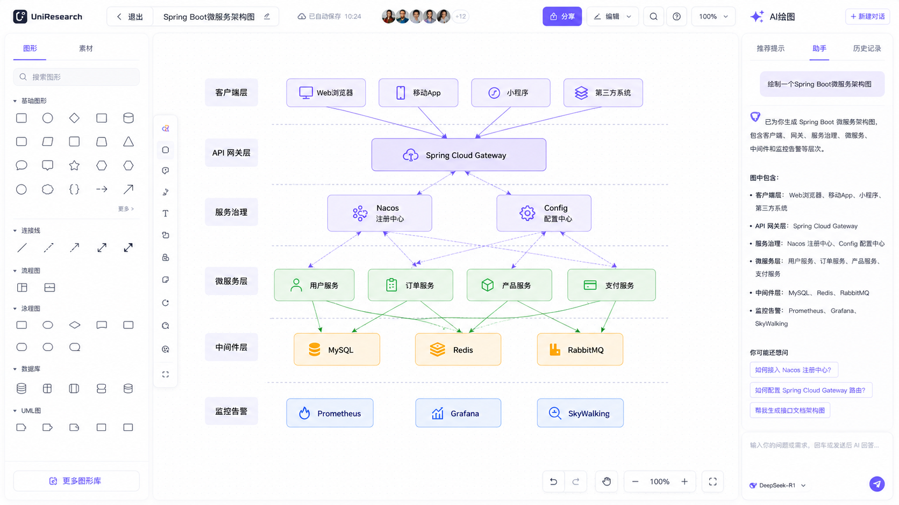

# uni-flexible-draw 项目技术规格书

> 基于 Vue3 + TypeScript + AntV X6 的通用绘图组件库

---

## 1. 项目概述

### 1.1 目标
构建一个基于 Vue3 的通用绘图组件库，支持流程图、UML图、时序图、数据流图、实体关系图等多种图形的绘制，并预留 AI 绘图扩展能力。

### 1.2 核心特性
- **组件化设计**：核心画布作为独立组件发布，支持按需引入
- **Monorepo 架构**：多包管理，支持独立发布
- **JSON 驱动**：所有图形数据以 JSON 描述，支持序列化/反序列化
- **素材库系统**：图形模板 JSON 化，可动态加载扩展
- **AI 扩展预留**：数据格式预留 AI 生成通道
- **画布操控**：撤销/重做、仅拖动模式、缩放、minimap

### 1.3 参考设计

- 左侧：分类图形素材面板
- 中间：主画布区域
- 右侧：AI 助手面板（仅 example）
- 顶部：标题、工具栏
- 底部：画布操控工具栏

---

## 2. Monorepo 架构

```
uni-flexible-draw/
├── packages/
│   ├── core/                    # 核心画布引擎（基于 X6 封装）
│   │   ├── src/
│   │   │   ├── graph/           # 图实例管理
│   │   │   ├── node/            # 节点注册与渲染
│   │   │   ├── edge/            # 边注册与渲染
│   │   │   ├── tool/            # 内置工具（缩放、minimap 等）
│   │   │   ├── command/         # 命令模式（撤销/重做）
│   │   │   ├── export/          # 导入导出
│   │   │   └── types/           # 类型定义
│   │   └── package.json
│   │
│   ├── shapes/                  # 图形定义库
│   │   ├── src/
│   │   │   ├── basic/           # 基础图形（矩形、圆、菱形等）
│   │   │   ├── flowchart/       # 流程图图形
│   │   │   ├── uml/             # UML 图形
│   │   │   ├── sequence/        # 时序图图形
│   │   │   ├── er/              # 实体关系图图形
│   │   │   ├── dfd/             # 数据流图图形
│   │   │   ├── swimlane/        # 泳道图
│   │   │   └── medical/         # 医学专用图形
│   │   └── package.json
│   │
│   ├── vue-components/          # Vue3 组件封装
│   │   ├── src/
│   │   │   ├── FlexibleDraw/    # 主画布组件
│   │   │   ├── ShapePanel/      # 图形素材面板
│   │   │   ├── Toolbar/         # 工具栏组件
│   │   │   ├── MiniMap/         # 缩略图组件
│   │   │   └── index.ts         # 统一导出
│   │   └── package.json
│   │
│   ├── materials/               # 素材库（JSON 模板）
│   │   ├── src/
│   │   │   ├── basic.json       # 基础图形素材
│   │   │   ├── flowchart.json   # 流程图素材
│   │   │   ├── uml.json         # UML 素材
│   │   │   └── ...
│   │   └── package.json
│   │
│   └── shared/                  # 共享工具与类型
│       ├── src/
│       │   ├── types/           # 全局类型
│       │   ├── utils/           # 工具函数
│       │   └── constants/       # 常量
│       └── package.json
│
├── examples/                    # 示例应用
│   ├── ai-draw/                 # AI 绘图完整示例
│   │   ├── src/
│   │   │   ├── App.vue
│   │   │   ├── main.ts
│   │   │   ├── components/      # 业务组件（AI 面板等）
│   │   │   └── stores/          # 状态管理
│   │   └── package.json
│   └── basic-draw/              # 基础绘图示例
│
├── docs/                        # 文档
├── scripts/                     # 构建脚本
├── pnpm-workspace.yaml
├── package.json
├── tsconfig.json
└── vite.config.ts
```

---

## 3. 技术栈

| 层级 | 技术 |
|------|------|
| 框架 | Vue 3.4+ (Composition API) |
| 语言 | TypeScript 5.x |
| 画布引擎 | AntV X6 2.x |
| 包管理 | pnpm 9.x + workspaces |
| 构建 | Vite 5.x |
| 节点版本管理 | Volta + nvm |
| 测试 | Vitest + Vue Test Utils |
| 代码规范 | ESLint + Prettier |

---

## 4. 核心数据规范（JSON Schema）

> **本规范为项目核心契约，所有图形序列化、AI 生成、素材库均遵循此格式。**

### 4.1 画布数据根结构

```typescript
interface GraphData {
  /** 画布配置 */
  canvas: CanvasConfig;
  /** 节点列表 */
  nodes: NodeData[];
  /** 边列表 */
  edges: EdgeData[];
  /** 元数据 */
  meta?: GraphMeta;
}

interface CanvasConfig {
  /** 画布背景色 */
  backgroundColor?: string;
  /** 网格配置 */
  grid?: {
    size: number;
    visible: boolean;
    type: 'dot' | 'line';
    color?: string;
  };
  /** 初始缩放 */
  zoom?: number;
  /** 初始偏移 */
  offset?: { x: number; y: number };
}

interface GraphMeta {
  /** 图表标题 */
  title?: string;
  /** 图表类型 */
  type?: 'flowchart' | 'uml' | 'sequence' | 'er' | 'dfd' | 'custom';
  /** 创建时间 */
  createdAt?: string;
  /** 版本 */
  version?: string;
  /** AI 生成标记 */
  aiGenerated?: boolean;
  /** 扩展字段（预留） */
  ext?: Record<string, unknown>;
}
```

### 4.2 节点数据规范

```typescript
interface NodeData {
  /** 全局唯一 ID */
  id: string;
  /** 图形类型标识 */
  shape: string;
  /** 位置 */
  position: { x: number; y: number };
  /** 尺寸 */
  size: { width: number; height: number };
  /** 角度（旋转） */
  angle?: number;
  /** Z 层级 */
  zIndex?: number;
  /** 节点样式 */
  style?: NodeStyle;
  /** 文本/标签 */
  label?: string | LabelConfig;
  /** 业务数据（用户自定义） */
  data?: Record<string, unknown>;
  /** 连接桩（锚点）配置 */
  ports?: PortsConfig;
  /** 是否锁定 */
  locked?: boolean;
}

interface NodeStyle {
  /** 填充色 */
  fill?: string;
  /** 边框色 */
  stroke?: string;
  /** 边框宽度 */
  strokeWidth?: number;
  /** 圆角 */
  rx?: number;
  ry?: number;
  /** 透明度 */
  opacity?: number;
  /** 阴影 */
  shadow?: {
    color: string;
    blur: number;
    offsetX: number;
    offsetY: number;
  };
  /** 扩展样式（各 shape 自定义） */
  [key: string]: unknown;
}

interface LabelConfig {
  text: string;
  position?: 'top' | 'bottom' | 'left' | 'right' | 'center';
  style?: {
    fill?: string;
    fontSize?: number;
    fontFamily?: string;
    fontWeight?: 'normal' | 'bold';
  };
}

interface PortsConfig {
  groups?: Record<string, PortGroup>;
  items?: PortItem[];
}

interface PortGroup {
  position: string | { name: string; args?: Record<string, unknown> };
  attrs?: Record<string, unknown>;
}

interface PortItem {
  id: string;
  group: string;
  attrs?: Record<string, unknown>;
}
```

### 4.3 边数据规范

```typescript
interface EdgeData {
  /** 全局唯一 ID */
  id: string;
  /** 边类型 */
  shape: string;
  /** 源节点/端口 */
  source: string | { cell: string; port?: string };
  /** 目标节点/端口 */
  target: string | { cell: string; port?: string };
  /** 边样式 */
  style?: EdgeStyle;
  /** 标签 */
  label?: string | LabelConfig;
  /** 业务数据 */
  data?: Record<string, unknown>;
  /** 顶点（折线点） */
  vertices?: Array<{ x: number; y: number }>;
  /** 路由方式 */
  router?: string | { name: string; args?: Record<string, unknown> };
  /** 连接器 */
  connector?: string | { name: string; args?: Record<string, unknown> };
}

interface EdgeStyle {
  /** 线条颜色 */
  stroke?: string;
  /** 线条宽度 */
  strokeWidth?: number;
  /** 线型 */
  strokeDasharray?: string;
  /** 源箭头 */
  sourceMarker?: MarkerConfig;
  /** 目标箭头 */
  targetMarker?: MarkerConfig;
}

interface MarkerConfig {
  /** 箭头类型 */
  name: 'block' | 'classic' | 'diamond' | 'cross' | 'circle' | 'none';
  /** 大小 */
  size?: number;
  /** 颜色 */
  fill?: string;
  /** 描边色 */
  stroke?: string;
}
```

### 4.4 素材库 JSON 规范

```typescript
interface MaterialLibrary {
  /** 素材库 ID */
  id: string;
  /** 显示名称 */
  name: string;
  /** 分类 */
  category: string;
  /** 图标 */
  icon?: string;
  /** 图形模板列表 */
  items: MaterialItem[];
}

interface MaterialItem {
  /** 模板 ID */
  id: string;
  /** 显示名称 */
  name: string;
  /** 预览图标（SVG 字符串或 base64） */
  icon?: string;
  /** 图形类型 */
  shape: string;
  /** 默认尺寸 */
  defaultSize: { width: number; height: number };
  /** 默认样式（合并到节点样式） */
  defaultStyle?: Partial<NodeStyle>;
  /** 默认标签 */
  defaultLabel?: string;
  /** 连接桩配置 */
  defaultPorts?: PortsConfig;
  /** 附加数据 */
  data?: Record<string, unknown>;
}
```

### 4.5 AI 生成数据通道

AI 生成的图形数据直接输出 `GraphData` 格式。扩展预留：

```typescript
interface AIGraphData extends GraphData {
  meta: GraphMeta & {
    aiGenerated: true;
    /** AI 模型信息 */
    aiModel?: string;
    /** 原始提示词 */
    prompt?: string;
    /** 置信度 */
    confidence?: number;
  };
}
```

---

## 5. 图形分类与 Shape 注册规范

### 5.1 Shape 命名规范

```
{category}-{shapeName}

例如：
- basic-rect
- basic-circle
- basic-diamond
- basic-cylinder
- basic-parallelogram
- basic-trapezoid
- basic-triangle
- basic-hexagon
- basic-pentagon
- basic-star
- flowchart-start-end
- flowchart-process
- flowchart-decision
- flowchart-input-output
- flowchart-document
- flowchart-predefined
- flowchart-database
- flowchart-internal-storage
- flowchart-connector
- flowchart-off-page
- flowchart-merge
- flowchart-or
- flowchart-summing-junction
- uml-class
- uml-interface
- uml-abstract
- uml-package
- uml-note
- sequence-actor
- sequence-lifeline
- sequence-activation
- sequence-message
- sequence-self-message
- er-entity
- er-weak-entity
- er-relationship
- er-attribute
- er-key-attribute
- swimlane-horizontal
- swimlane-vertical
- medical-human-front
- medical-human-back
- medical-organ-{name}
```

### 5.2 各分类图形清单

#### 基础图形 (basic)
| Shape | 说明 |
|-------|------|
| basic-rect | 矩形 |
| basic-rounded-rect | 圆角矩形 |
| basic-circle | 圆形/椭圆 |
| basic-diamond | 菱形 |
| basic-triangle | 三角形 |
| basic-parallelogram | 平行四边形 |
| basic-trapezoid | 梯形 |
| basic-pentagon | 五边形 |
| basic-hexagon | 六边形 |
| basic-octagon | 八边形 |
| basic-star | 星形 |
| basic-cross | 十字形 |
| basic-cylinder | 圆柱体（数据库） |
| basic-cloud | 云形 |
| basic-document | 文档形 |

#### 连接线 (edge)
| Shape | 说明 |
|-------|------|
| edge-line | 直线 |
| edge-dashed | 虚线 |
| edge-arrow | 单向箭头 |
| edge-double-arrow | 双向箭头 |
| edge-curve | 曲线 |
| edge-orthogonal | 正交线 |

#### 流程图 (flowchart)
| Shape | 说明 |
|-------|------|
| flowchart-start-end | 开始/结束（圆角矩形） |
| flowchart-process | 处理（矩形） |
| flowchart-decision | 判断（菱形） |
| flowchart-input-output | 输入输出（平行四边形） |
| flowchart-document | 文档 |
| flowchart-predefined | 预定义过程（双边矩形） |
| flowchart-internal-storage | 内部存储 |
| flowchart-database | 数据库（圆柱） |
| flowchart-connector | 连接器（小圆） |
| flowchart-off-page | 离页引用 |
| flowchart-merge | 合并 |
| flowchart-or | 或 |
| flowchart-summing-junction | 求和 |

#### UML (uml)
| Shape | 说明 |
|-------|------|
| uml-class | 类（三栏矩形） |
| uml-interface | 接口 |
| uml-abstract | 抽象类 |
| uml-package | 包 |
| uml-note | 注释 |
| uml-actor | 参与者 |
| uml-use-case | 用例 |
| uml-component | 组件 |
| uml-deployment | 部署节点 |
| uml-state | 状态 |
| uml-initial | 初始状态 |
| uml-final | 终止状态 |

#### 时序图 (sequence)
| Shape | 说明 |
|-------|------|
| sequence-actor | 参与者 |
| sequence-lifeline | 生命线 |
| sequence-activation | 激活条 |
| sequence-message | 消息箭头 |
| sequence-self-message | 自消息 |
| sequence-fragment | 组合片段 |

#### 实体关系图 (er)
| Shape | 说明 |
|-------|------|
| er-entity | 实体（矩形） |
| er-weak-entity | 弱实体（双边矩形） |
| er-relationship | 关系（菱形） |
| er-attribute | 属性（椭圆） |
| er-key-attribute | 键属性（下划线椭圆） |
| er-multivalued | 多值属性（双边椭圆） |

#### 数据流图 (dfd)
| Shape | 说明 |
|-------|------|
| dfd-process | 处理（圆角矩形/圆） |
| dfd-data-store | 数据存储（开口矩形） |
| dfd-external-entity | 外部实体（矩形） |
| dfd-data-flow | 数据流（箭头） |

#### 泳道图 (swimlane)
| Shape | 说明 |
|-------|------|
| swimlane-horizontal | 横向泳道 |
| swimlane-vertical | 纵向泳道 |
| swimlane-pool | 泳池容器 |

#### 医学图形 (medical) - 预留扩展
| Shape | 说明 |
|-------|------|
| medical-human-front | 人体正面轮廓 |
| medical-human-back | 人体背面轮廓 |
| medical-organ-heart | 心脏 |
| medical-organ-lung | 肺 |
| medical-organ-brain | 脑 |
| ... | 按需扩展 |

---

## 6. 组件 API 设计

### 6.1 FlexibleDraw 主画布组件

```vue
<template>
  <FlexibleDraw
    v-model="graphData"
    :canvas-config="canvasConfig"
    :shapes="registeredShapes"
    :readonly="false"
    :minimap="true"
    :grid="gridConfig"
    :snapline="true"
    @node:click="onNodeClick"
    @edge:click="onEdgeClick"
    @blank:click="onBlankClick"
    @change="onChange"
    @history:change="onHistoryChange"
  />
</template>
```

```typescript
interface FlexibleDrawProps {
  /** 双向绑定：画布数据 */
  modelValue: GraphData;
  /** 画布配置 */
  canvasConfig?: CanvasConfig;
  /** 注册的图形列表 */
  shapes?: string[];
  /** 只读模式 */
  readonly?: boolean;
  /** 是否显示 minimap */
  minimap?: boolean;
  /** 网格配置 */
  grid?: GridConfig | boolean;
  /** 对齐线 */
  snapline?: boolean;
  /** 快捷键启用 */
  keyboard?: boolean;
  /** 选中状态回调防抖（ms） */
  selectionDebounce?: number;
}

interface FlexibleDrawEmits {
  (e: 'update:modelValue', data: GraphData): void;
  (e: 'change', data: GraphData, event: ChangeEvent): void;
  (e: 'node:click', node: NodeData, event: MouseEvent): void;
  (e: 'node:dblclick', node: NodeData, event: MouseEvent): void;
  (e: 'node:contextmenu', node: NodeData, event: MouseEvent): void;
  (e: 'edge:click', edge: EdgeData, event: MouseEvent): void;
  (e: 'blank:click', event: MouseEvent): void;
  (e: 'selection:change', nodes: NodeData[], edges: EdgeData[]): void;
  (e: 'history:change', canUndo: boolean, canRedo: boolean): void;
}
```

### 6.2 组件方法（Expose）

```typescript
interface FlexibleDrawExpose {
  /** 获取当前画布数据 */
  getData(): GraphData;
  /** 加载画布数据 */
  setData(data: GraphData): void;
  /** 导出为 JSON */
  toJSON(): string;
  /** 从 JSON 导入 */
  fromJSON(json: string): void;
  /** 导出为图片 */
  toPNG(options?: ExportImageOptions): Promise<string>;
  toSVG(options?: ExportImageOptions): Promise<string>;
  /** 缩放 */
  zoom(factor: number | 'fit' | 'real'): void;
  zoomTo(factor: number): void;
  getZoom(): number;
  /** 居中 */
  center(): void;
  centerContent(): void;
  /** 撤销/重做 */
  undo(): void;
  redo(): void;
  canUndo(): boolean;
  canRedo(): boolean;
  /** 添加/删除节点或边 */
  addNode(node: NodeData): void;
  addEdge(edge: EdgeData): void;
  removeNode(id: string): void;
  removeEdge(id: string): void;
  /** 选中 */
  select(nodes: string[], edges?: string[]): void;
  clearSelection(): void;
  /** 从素材创建节点 */
  createNodeFromMaterial(material: MaterialItem, position?: { x: number; y: number }): NodeData;
}
```

### 6.3 ShapePanel 图形面板组件

```vue
<template>
  <ShapePanel
    :libraries="libraries"
    :searchable="true"
    :collapsible="true"
    @dragstart="onDragStart"
    @select="onSelect"
  />
</template>
```

```typescript
interface ShapePanelProps {
  /** 素材库列表 */
  libraries: MaterialLibrary[];
  /** 是否可搜索 */
  searchable?: boolean;
  /** 是否可折叠分类 */
  collapsible?: boolean;
  /** 默认展开的分类 */
  defaultExpanded?: string[];
  /** 自定义渲染项 */
  itemRenderer?: (item: MaterialItem) => VNode;
}

interface ShapePanelEmits {
  (e: 'dragstart', item: MaterialItem, event: DragEvent): void;
  (e: 'select', item: MaterialItem): void;
}
```

### 6.4 Toolbar 工具栏组件

```vue
<template>
  <Toolbar
    :actions="actions"
    :zoom="currentZoom"
    :can-undo="canUndo"
    :can-redo="canRedo"
    @action="onAction"
    @zoom-change="onZoomChange"
  />
</template>
```

---

## 7. 设计模式应用

### 7.1 命令模式（Command Pattern）
- 封装所有画布操作（添加/删除/移动/修改节点边）为 Command 对象
- 实现 `ICommand` 接口：`execute()`、`undo()`、`redo()`
- `CommandManager` 维护 undo/redo 栈
- 支持事务批量命令（如同时移动多个节点）

### 7.2 工厂模式（Factory Pattern）
- `NodeFactory`：根据 shape 类型创建对应 X6 Node
- `EdgeFactory`：根据 shape 类型创建对应 X6 Edge
- `ShapeRegistry`：运行时注册/注销自定义图形

### 7.3 策略模式（Strategy Pattern）
- `ExportStrategy`：JSON / PNG / SVG 导出策略
- `RouterStrategy`：边的路由算法策略
- `LayoutStrategy`：自动布局策略（预留）

### 7.4 观察者模式（Observer Pattern）
- `GraphEventBus`：画布事件总线
- Vue 组件通过事件总线监听 X6 底层事件并转换 emits

### 7.5 装饰器模式（Decorator Pattern）
- `ShapeDecorator`：为基础 shape 动态添加连接桩、标签、样式等
- 支持运行时扩展图形能力

---

## 8. 画布功能详细规范

### 8.1 撤销/重做（Undo/Redo）
- 基于命令模式实现
- 记录所有数据变更操作
- 快捷键：Ctrl+Z / Ctrl+Shift+Z (Ctrl+Y)
- 提供 `history:change` 事件输出 canUndo / canRedo 状态
- 支持最大历史步数限制（默认 50 步，可配置）

### 8.2 仅拖动模式（Pan Mode）
- 切换后画布不可编辑，仅可拖拽平移
- 鼠标指针变为手型
- 可通过空格键临时切换（按住空格拖动平移）

### 8.3 缩放（Zoom）
- 鼠标滚轮缩放（以鼠标位置为中心）
- 工具栏放大/缩小按钮
- 缩放到实际大小 / 适应画布 / 适应内容
- 快捷键：Ctrl+滚轮、Ctrl+0（实际大小）、Ctrl+1（适应内容）

### 8.4 Minimap
- 基于 X6 内置 Minimap 插件封装
- 可配置尺寸、位置、缩略图样式
- 支持在 minimap 中框选定位

### 8.5 其他交互
- 框选（Shift/框选模式）
- 多选（Ctrl/Shift + 点击）
- 对齐线（Snapline）
- 画布平移（右键拖拽 / 空格+拖拽）
- 节点连线（端口拖拽连线）
- 拖拽创建（从面板拖拽到画布）

---

## 9. AI 绘图集成规范（Example 层）

### 9.1 架构位置
AI 绘图功能属于 `examples/ai-draw`，**不属于组件库核心**。

### 9.2 数据流
```
用户输入 Prompt
    ↓
AI Service（后端 / API）
    ↓
返回 AIGraphData（符合 GraphData 规范）
    ↓
调用 FlexibleDraw.setData() 渲染
```

### 9.3 AI 面板组件（Example 业务组件）
```vue
<template>
  <div class="ai-panel">
    <AIChat :messages="messages" @send="onSend" />
    <AIHistory :records="historyRecords" @select="loadHistory" />
    <AIPrompts :suggestions="suggestions" @select="applyPrompt" />
  </div>
</template>
```

### 9.4 提示词工程规范
- AI 返回的必须是严格符合 `GraphData` JSON Schema 的数据
- 提示词需约束：shape 类型必须在已注册列表中
- 支持流式返回与增量渲染（预留）

---

## 10. 导入导出规范

### 10.1 JSON 导入导出
- 导出：完整 `GraphData` JSON
- 导入：校验 JSON Schema，兼容版本迁移
- 文件扩展名：`.draw.json`

### 10.2 图片导出
- PNG：基于 X6 `toPNG()`，支持背景色、padding、质量
- SVG：矢量导出，支持编辑

### 10.3 版本兼容性
- `GraphData.meta.version` 标记数据版本
- 导入时若版本不匹配，走 `DataMigration` 策略

---

## 11. 构建与发布

### 11.1 构建输出

| 包 | 输出格式 |
|----|---------|
| @uni-draw/core | ESM + CJS + UMD + d.ts |
| @uni-draw/shapes | ESM + CJS + d.ts |
| @uni-draw/vue-components | ESM + CJS + d.ts + 样式文件 |
| @uni-draw/materials | JSON + d.ts |
| @uni-draw/shared | ESM + CJS + d.ts |

### 11.2 独立发布
- 每个 package 独立版本号
- 使用 `changesets` 管理版本和 CHANGELOG
- 支持按需引入：`import { FlexibleDraw } from '@uni-draw/vue-components'`

### 11.3 全局安装
- 提供 `Vue.use(UniDraw)` 方式
- 自动注册全局组件

---

## 12. 开发规范

### 12.1 目录命名
- 包名：kebab-case（如 `vue-components`）
- 组件名：PascalCase（如 `FlexibleDraw.vue`）
- 工具函数：camelCase
- 常量：UPPER_SNAKE_CASE

### 12.2 代码规范
- ESLint + Prettier + Vue 官方规范
- 提交前自动格式化
- TypeScript `strict` 模式开启

### 12.3 文档注释
- 公共 API 必须写 JSDoc
- 复杂业务逻辑需写行内注释

---

## 13. 示例应用规范

### 13.1 ai-draw 完整示例
- 集成所有组件
- 包含 AI 面板业务组件
- 模拟 AI Service（mock 数据）
- 展示完整交互流程

### 13.2 basic-draw 基础示例
- 仅展示基础绘图功能
- 无 AI 相关代码
- 适合作为组件库快速上手 demo

---

## 14. 里程碑规划

| 阶段 | 内容 |
|------|------|
| M1 | Monorepo 基建 + Core 核心封装 + Vue 主组件 |
| M2 | 基础图形 + 流程图 + 连接线 + 素材库 |
| M3 | UML + 时序图 + ER + DFD 图形 |
| M4 | 泳道图 + 画布高级功能（minimap、对齐等） |
| M5 | 医学图形扩展 + 示例系统 + AI 面板 |
| M6 | 优化 + 文档 + 发布 |

---

## 15. 风险与预留

1. **X6 版本兼容性**：锁定 X6 2.x 主要版本，升级需评估
2. **医学图形复杂度**：人体轮廓等复杂图形采用 SVG Path 实现，性能需测试
3. **AI 数据安全**：AI 生成的图形数据在 example 层处理，核心库不接触敏感数据
4. **扩展性**：ShapeRegistry 支持运行时注册新图形，满足未来扩展
